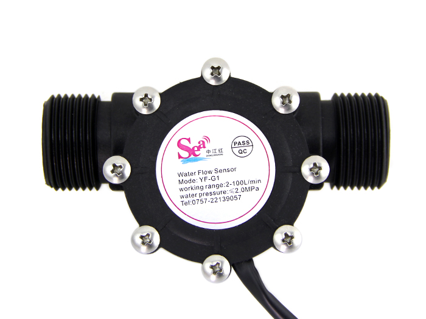

# AquaTrack ESP

## LE PROJET

AquaTrack ESP est un projet DIY qui permet de mesurer la quantité d'eau consommée en utilisant un Webmos D1 Mini Pro et un capteur de débit d'eau. Le projet est basé sur ESPHome pour une intégration facile avec les systèmes domotiques.

## LES PRÉ-REQUIS

- Connaissances de base en électronique et en programmation.
- Un environnement de développement pour ESPHome.
- Accès à un réseau Wi-Fi pour la configuration et le suivi.

## LE BOÎTIER

A Faire en Impression 3D ....

## LE HARDWARE

- Webmos D1 Mini Pro
- Capteur de débit d'eau : G1 Water Flow Sensor

et sa Data Sheet : [YF-G1 DN25 1inch Water Flow Sensor](YF-G1%20DN25%201inch%20Water%20Flow%20Sensor.pdf)
 

## LE YAML pour ESP HOME

Disponiblible ici : [wifi-waterpumpflow.yaml](wifi-waterpumpflow.yaml)  
