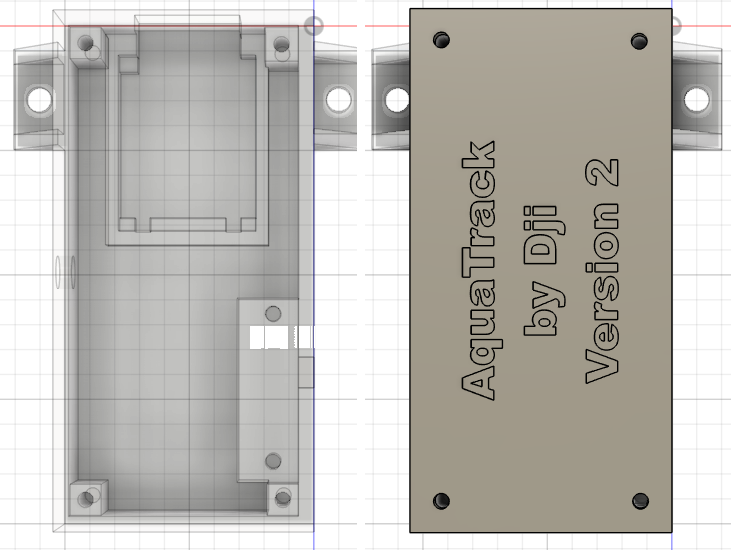

# AquaTrack ESP

## LE PROJET

AquaTrack ESP est un projet DIY qui permet de mesurer la quantité d'eau consommée en utilisant un Webmos D1 Mini Pro et un capteur de débit d'eau. Le projet est basé sur ESPHome pour une intégration facile avec [Home Assistant](https://www.home-assistant.io/).

## LES PRÉ-REQUIS

- Connaissances de base en électronique et en programmation.
- Un environnement de développement pour ESPHome.
- Accès à un réseau Wi-Fi pour la configuration et le suivi.

## LE BOÎTIER

| Fusion 360 | En vrai ! |
|------------|------------|
|  | Photos à venir... |
| Fichier Fusion360 :  [Boitier AquaTrack v2](SourceFusion360/Boitier%20AquaTrack%20v2.f3d) |  |

## LE HARDWARE

| Webmos D1 Mini Pro| Capteur de débit d'eau : G1 Water Flow Sensor | 
|------------|------------| 
| |  | 
| | Data Sheet : [YF-G1 DN25 1inch Water Flow Sensor](YF-G1%20DN25%201inch%20Water%20Flow%20Sensor.pdf) | 

et sa Data Sheet : [YF-G1 DN25 1inch Water Flow Sensor](YF-G1%20DN25%201inch%20Water%20Flow%20Sensor.pdf)

## CALCUL DE LA QUANTITE D'EAU PAR IMPLUSION

Pour calculer la quantité d'eau en litres pour chaque impulsion du capteur de débit d'eau YF-G1, nous pouvons utiliser les informations fournies dans la fiche technique.
La caractéristique de l'impulsion de débit est donnée par la formule :

    f = 4.8 × Q

où :

 - f est la fréquence des impulsions en Hz.
 - Q est le débit en litres par minute (L/min).

Calcul de la quantité d'eau par impulsion

1 Convertir la fréquence en impulsions par litre :

La formule f=4.8×Q peut être réarrangée pour trouver le nombre d'impulsions par litre.

- Si Q=1 L/min, alors f = 4.8
- f=4.8 Hz, ce qui signifie 4.8 impulsions par litre.

2 Calculer la quantité d'eau par impulsion :
- Pour trouver la quantité d'eau par impulsion, nous prenons l'inverse du nombre d'impulsions par litre.
- Quantite d’eau par impulsion = 1 4.8 = Quantite d’eau par impulsion = 4.8 / 1 litres par impulsion.

Calculons cela :

D'après la fiche technique du capteur de débit d'eau YF-G1, chaque impulsion correspond à environ 0,208 litres d'eau. Cela signifie que pour chaque impulsion générée par le capteur, environ 0,208 litres d'eau ont traversé le capteur.

## LE CÂBLAGE
Voici le schéma du montage prévu.

## LE YAML pour ESP HOME

Disponiblible ici : [wifi-waterpumpflow.yaml](wifi-waterpumpflow.yaml)  
